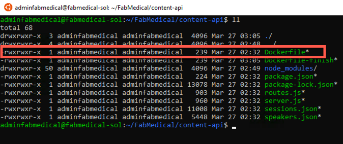
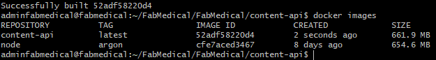
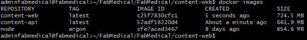
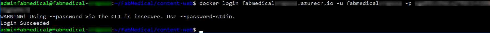
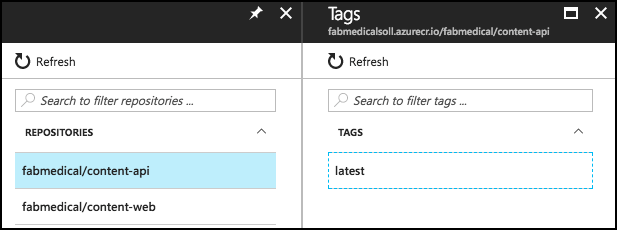
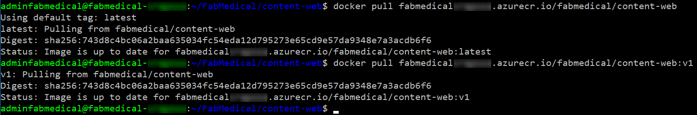
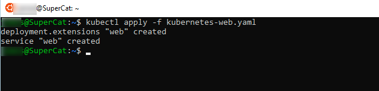

<div class="MCWHeader1">
Containers and DevOps
</div>

<div class="MCWHeader2">
Hands-on lab step-by-step
</div>

<div class="MCWHeader3">
March 2018
</div>

Information in this document, including URL and other Internet Web site references, is subject to change without notice. Unless otherwise noted, the example companies, organizations, products, domain names, e-mail addresses, logos, people, places, and events depicted herein are fictitious, and no association with any real company, organization, product, domain name, e-mail address, logo, person, place or event is intended or should be inferred. Complying with all applicable copyright laws is the responsibility of the user. Without limiting the rights under copyright, no part of this document may be reproduced, stored in or introduced into a retrieval system, or transmitted in any form or by any means (electronic, mechanical, photocopying, recording, or otherwise), or for any purpose, without the express written permission of Microsoft Corporation.

Microsoft may have patents, patent applications, trademarks, copyrights, or other intellectual property rights covering subject matter in this document. Except as expressly provided in any written license agreement from Microsoft, the furnishing of this document does not give you any license to these patents, trademarks, copyrights, or other intellectual property.

The names of manufacturers, products, or URLs are provided for informational purposes only and Microsoft makes no representations and warranties, either expressed, implied, or statutory, regarding these manufacturers or the use of the products with any Microsoft technologies. The inclusion of a manufacturer or product does not imply endorsement of Microsoft of the manufacturer or product. Links may be provided to third party sites. Such sites are not under the control of Microsoft and Microsoft is not responsible for the contents of any linked site or any link contained in a linked site, or any changes or updates to such sites. Microsoft is not responsible for webcasting or any other form of transmission received from any linked site. Microsoft is providing these links to you only as a convenience, and the inclusion of any link does not imply endorsement of Microsoft of the site or the products contained therein.
© 2018 Microsoft Corporation. All rights reserved.

Microsoft and the trademarks listed at https://www.microsoft.com/en-us/legal/intellectualproperty/Trademarks/Usage/General.aspx are trademarks of the Microsoft group of companies. All other trademarks are property of their respective owners.

**Contents**

<!-- TOC -->

- [Containers and DevOps hands-on lab step-by-step](#containers-and-devops-hands-on-lab-step-by-step)
    - [Abstract and learning objectives](#abstract-and-learning-objectives)
    - [Overview](#overview)
    - [Solution architecture](#solution-architecture)
    - [Requirements](#requirements)
    - [Exercise 1: Create and run a Docker application](#exercise-1-create-and-run-a-docker-application)
        - [Task 1: Test the application](#task-1-test-the-application)
        - [Task 2: Enable browsing to the web application](#task-2-enable-browsing-to-the-web-application)
        - [Task 3: Create a Dockerfile](#task-3-create-a-dockerfile)
        - [Task 4: Create Docker images](#task-4-create-docker-images)
        - [Task 5: Run a containerized application](#task-5-run-a-containerized-application)
        - [Task 6: Setup environment variables](#task-6-setup-environment-variables)
        - [Task 7: Push images to Azure Container Registry](#task-7-push-images-to-azure-container-registry)
    - [Exercise 2: Deploy the solution to Azure Container Service](#exercise-2-deploy-the-solution-to-azure-container-service)
        - [Task 1: Tunnel into the Azure Container Service cluster](#task-1-tunnel-into-the-azure-container-service-cluster)
        - [Task 2: Deploy a service using the Kubernetes management dashboard](#task-2-deploy-a-service-using-the-kubernetes-management-dashboard)
        - [Task 3: Deploy a service using Kubernetes REST API](#task-3-deploy-a-service-using-kubernetes-rest-api)
        - [Task 4: Explore service instance logs and resolve an issue](#task-4-explore-service-instance-logs-and-resolve-an-issue)
        - [Task 5: Test the application in a browser](#task-5-test-the-application-in-a-browser)
    - [Exercise 3: Scale the application and test HA](#exercise-3-scale-the-application-and-test-ha)
        - [Task 1: Increase service instances from the Kubernetes dashboard](#task-1-increase-service-instances-from-the-kubernetes-dashboard)
        - [Task 2: Increase service instances beyond available resources](#task-2-increase-service-instances-beyond-available-resources)
        - [Task 3: Restart containers and test HA](#task-3-restart-containers-and-test-ha)
    - [Exercise 4: Setup load balancing and service discovery](#exercise-4-setup-load-balancing-and-service-discovery)
        - [Task 1: Create a public load balancer for a service](#task-1-create-a-public-load-balancer-for-a-service)
        - [Task 2: Scale a service without port constraints](#task-2-scale-a-service-without-port-constraints)
        - [Task 3: Update a service to support dynamic service discovery without a load balancer](#task-3-update-a-service-to-support-dynamic-service-discovery-without-a-load-balancer)
        - [Task 4: Update an external service to support dynamic discovery with a load balancer](#task-4-update-an-external-service-to-support-dynamic-discovery-with-a-load-balancer)
        - [Task 5: Adjust CPU constraints to improve scale](#task-5-adjust-cpu-constraints-to-improve-scale)
        - [Task 6: Perform a rolling update](#task-6-perform-a-rolling-update)
    - [After the hands-on lab](#after-the-hands-on-lab)

<!-- /TOC -->

# Containers and DevOps hands-on lab step-by-step

## Abstract and learning objectives

Build a PoC to deliver a multi-tenant web app hosting solution leveraging Azure Kubernetes Service, Docker containers, and Linux nodes.

Attendees will be better able to deploy Docker-based applications and scale them with Azure Container Service and Kubernetes orchestration. In addition,

- Create and run a Docker Application

- Deploy to the Azure Kubernetes Service

- Implement load balancing and service discovery

- Scale the application and test availability

- Use Kubernetes ingress for path based routing and TLS termination.

## Overview

Fabrikam Medical Conferences (FabMedical) provides conference website services tailored to the medical community. They are refactoring their application code, based on node.js, so that it can run as a Docker application, and want to implement a POC that will help them get familiar with the development process, lifecycle of deployment, and critical aspects of the hosting environment. They will be deploying their applications to Azure Kubernetes Service and want to learn how to deploy containers in a dynamically load-balanced manner, discover containers, and scale them on demand.

In this hands-on lab, you will assist with completing this POC with a subset of the application code base. You will create a build agent based on Linux, and an Azure Container Service cluster for running deployed applications. You will be helping them to complete the Docker setup for their application, test locally, push to an image repository, deploy to the cluster, and test load-balancing and scale.

**IMPORTANT: Most Azure resources require unique names. Throughout these steps you will see the word "SUFFIX" as part of resource names. You should replace this with your Microsoft email prefix to ensure the resource is uniquely named.**

## Solution architecture

Below is a diagram of the solution architecture you will build in this lab. Please study this carefully, so you understand the whole of the solution as you are working on the various components.

The solution will use Azure Kubernetes Service (AKS) which means that the container cluster topology is provisioned according to the number of requested nodes. The proposed containers deployed to the cluster are illustrated below, with MongoDB remaining as a managed service:


Each tenant will have the following containers:

-   **Conference Web site**: the SPA application that will use configuration settings to handle custom styles for the tenant

-   **Admin Web site**: the SPA application that conference owners use to manage conference configuration details, manage attendee registrations, manage campaigns and communicate with attendees

-   **Registration service**: the API that handles all registration activities creating new conference registrations with the appropriate package selections and associated cost

-   **Email service**: the API that handles email notifications to conference attendees during registration, or when the conference owners choose to engage the attendees through their admin site

-   **Config service**: the API that handles conference configuration settings such as dates, locations, pricing tables, early bird specials, countdowns and related

-   **Content service**: the API that handles content for the conference such as speakers, sessions, workshops and sponsors

## Requirements

1.  Microsoft Azure subscription must be pay-as-you-go or MSDN.

    a.  Trial subscriptions will *not* work.

    b.  You must have rights to create a service principal as discussed in Task 9: Create a Service Principal --- and this typically requires a subscription owner to log in. You may have to ask another subscription owner to login to the portal and execute that step ahead of time if you do not have the rights.

    c.  You must have enough cores available in your subscription to create the build agent and Azure Container Service cluster in Task 5: Create a build agent VM and Task 10: Create an Azure Kubernetes Service cluster. You'll need eight cores if following the exact instructions in the lab, more if you choose additional agents or larger VM sizes. If you execute the steps required before the lab, you will be able to see if you need to request more cores in your sub.

2.  Local machine or a virtual machine configured with:

    -   A browser, preferably Chrome for consistency with the lab implementation tests

    -   Command prompt

        -   On Windows, you will be using Bash on Ubuntu on Windows, hereon referred to as WSL.

        -   On Mac, all instructions should be executed using bash in Terminal.

3.  You will be asked to install other tools throughout the exercises.

**VERY IMPORTANT: You should be typing all of the commands as they appear in the guide, except where explicitly stated in this document. Do not try to copy and paste from Word to your command windows or other documents where you are instructed to enter information shown in this document. There can be issues with Copy and Paste from Word that result in errors, execution of instructions, or creation of file content.**


## Exercise 1: Create and run a Docker application

**Duration**: 40 minutes

In this exercise, you will take the starter files and run the node.js application as a Docker application. You will create a Dockerfile, build Docker images, and run containers to execute the application.

**NOTE: Complete these tasks from the WSL window with the build agent session.**

### Task 1: Test the application

The purpose of this task is to make sure you can run the application successfully before applying changes to run it as a Docker application.

1. From the WSL window, connect to your build agent if you are not already connected.

1. Type the following command to create a Docker network named "fabmedical".

    ```bash
    docker network create fabmedical
    ```

1. Run an instance of mongodb to use for local testing.

    ```bash
    docker run --name mongo --net fabmedical -p 27017:27017 -d mongo
    ```

1. Confirm that the mongo container is running and ready.

    ```bash
    docker container list
    docker logs mongo
    ```

    

1. Connect to the mongo instance using the mongo shell and test some basic commands.

    ```bash
    mongo
    ```

    ```text
    show dbs
    quit()
    ```

    

1. To initialize the local database with test content, first navigate to the content-init directory and run npm install.

    ```bash
    cd content-init
    npm install
    ```

1. Initialize the database.

    ```bash
    nodejs server.js
    ```

    

1. Confirm that the database now contains test data.

    ```bash
    mongo
    ```

    ```text
    show dbs
    use contentdb
    show collections
    db.speakers.find()
    db.sessions.find()
    quit()
    ```

    This should produce output similar to the following:

    

1. Now, navigate to the content-api directory and run npm install.

    ```bash
    cd ../content-api
    npm install
    ```

1. Start the API as a background process.

    ```bash
    nodejs ./server.js &
    ```

    

1. Press ENTER again to get to a command prompt for the next step.

1. Test the API using curl. You will request the speakers content, and this will return a JSON result.

    ```bash
    curl http://localhost:3001/speakers
    ```

1. Navigate to the web application directory, run npm install and bower install, and then run the application as a background process as well. Ignore any warnings you see in the output; this will not affect running the application.

    ```bash
    cd ../content-web
    npm install
    bower install
    nodejs ./server.js &
    ```

    

1. Press ENTER again to get a command prompt for the next step.

1. Test the web application using curl. You will see HTML output returned, without errors.

    ```bash
    curl http://localhost:3000
    ```

1. Leave the application running for the next task.

1. If you received a JSON response to the /speakers content request and an HTML response from the web application, your environment is working as expected.

### Task 2: Enable browsing to the web application

In this task, you will open a port range on the agent VM so that you can browse to the web application for testing.

1. From the Azure portal select the resource group you created named fabmedical-SUFFIX.

1. Select the Network Security Group associated with the build agent from your list of available resources.

    

1. From the Network interface essentials blade, select **Inbound security rules**.

    

1. Select **Add** to add a new rule.

    

1. From the Add inbound security rule blade, enter the values as shown in the screenshot below:

    - **Source**: Any

    - **Source port ranges**:

    - **Destination**: Any

    - **Destination Port Ranges**: 3000-3010

    - **Protocol**: Any

    - **Action**: Allow

    - **Priority**: Leave at the default priority setting

    - **Name**: Enter "allow-app-endpoints"

        

1. Select **OK** to save the new rule.

    

1. From the resource list shown in step 2, select the build agent VM named fabmedical-SUFFIX.

    

1. From the Virtual Machine blade overview, find the IP address of the VM.

    

1. Test the web application from a browser. Navigate to the web application using your build agent IP address at port 3000.

    ```text
    http://[BUILDAGENTIP]:3000

    EXAMPLE: http://13.68.113.176:3000
    ```

1. Select the Speakers and Sessions links in the header. You will see the pages display the HTML version of the JSON content you curled previously.

1. Once you have verified the application is accessible through a browser, go to your WSL window and stop the running node processes.

    ```bash
    killall nodejs
    ```

### Task 3: Create a Dockerfile

In this task, you will create a new Dockerfile that will be used to run the API application as a containerized application.

**NOTE: You will be working in a Linux VM without friendly editor tools. You must follow the steps very carefully to work with Vim for a few editing exercises if you are not already familiar with Vim.**

1. From WSL, navigate to the content-api folder. List the files in the folder with this command. The output should look like the screenshot below.

    ```bash
    cd ../content-api
    ll
    ```

    

1. Create a new file named "Dockerfile" and note the casing in the name. Use the following Vim command to create a new file. The WSL window should look as shown in the following screenshot.

    ```bash
    vi Dockerfile
    ```

    

1. Select "i" on your keyboard. You'll see the bottom of the window showing INSERT mode.

    

1. Type the following into the file. These statements produce a Dockerfile that describes the following:

    - The base stage includes environment setup which we expect to change very rarely, if at all.

        - Creates a new Docker image from the base image node:alpine. This base image has node.js on it and is optimized fro small size.

        - Add `curl` to the base image to support Docker health checks.

        - Creates a directory on the image where the application files can be copied.

        - Exposes application port 3001 to the container environment so that the application can be reached at port 3001.

    - The build stage contains all the tools and intermediate files needed to create the application.

        - Creates a new Docker image from node:argon

        - Creates a directory on the image where the application files can be copied.

        - Copies package.json to the working directory.

        - Runs npm install to initialize the node application environment.

        - Copies the source files for the application over to the image.

    - The final stage combines the base image with the build output from the build stage

        - Sets the working directory to the application file location.

        - Copies the app files from the build stage

        - Indicates the command to start the node application when the container is run.

    **NOTE: Type the following into the editor, as you may have errors with copying and pasting.**

    ```Dockerfile
    FROM node:alpine AS base
    RUN apk -U add curl
    WORKDIR /usr/src/app
    EXPOSE 3001

    FROM node:argon AS build
    WORKDIR /usr/src/app

    # Install app dependencies
    COPY package.json /usr/src/app/
    RUN npm install

    # Bundle app source
    COPY . /usr/src/app

    FROM base AS final
    WORKDIR /usr/src/app
    COPY --from=build /usr/src/app .
    CMD [ "npm", "start" ]
    ```

1. When you are finished typing, hit the Esc key and type ":wq" and hit the Enter key to save the changes and close the file.

    ```bash
    <Esc>
    :wq
    <Enter>
    ```

1. List the contents of the folder again, to verify the new Dockerfile has been created.

    ```bash
    ll
    ```

    

1. Verify the file contents, to ensure it was saved as expected. Type the following command to see the output of the Dockerfile in the command window.

    ```bash
    cat Dockerfile
    ```

### Task 4: Create Docker images

In this task, you will create Docker images for the application --- one for the API application and another for the web application. Each image will be created via Docker commands that rely on a Dockerfile.

1. From WSL, type the following command to view any Docker images on the VM. The list will only contain the mongodb image downloaded earlier.

    ```bash
    docker images
    ```

1. From the content-api folder containing the API application files and the new Dockerfile you created, type the following command to create a Docker image for the API application. This command does the following:

    - Executes the Docker build command to produce the image.

    - Tags the resulting image with the name content-api (-t).

    - The final dot (".") indicates to use the Dockerfile in this current directory context. By default, this file is expected to have the name "Dockerfile" (case sensitive).

    ```bash
    docker build -t content-api .
    ```

1. Once the image is successfully built, run the Docker images command again. You will see several new images: the node images and your container image.

    ```bash
    docker images
    ```

    Notice the untagged image.  This is the build stage which contains all the intermediate files not need in your final image.

    

1. Navigate to the content-web folder again and list the files. Note that this folder already has a Dockerfile.

    ```bash
    cd ../content-web
    ll
    ```

1. View the Dockerfile contents -- which are similar to the file you created previously in the API folder. Type the following command:

    ```bash
    cat Dockerfile
    ```

    Notice that the content-web Dockerfile build stage includes additional tools to install bower packages in addition to the npm packages.

1. Type the following command to create a Docker image for the web application.

    ```bash
    docker build -t content-web .
    ```

1. When complete, you will see seven images now exist when you run the Docker images command.

    ```bash
    docker images
    ```

    

### Task 5: Run a containerized application

The web application container will be calling endpoints exposed by the API application container and the API application container will be communicating with mongodb. In this exercise, you will launch the images you created as containers on same bridge network you created when starting mongodb.

1. Create and start the API application container with the following command. The command does the following:

    - Names the container "api" for later reference with Docker commands.

    - Instructs the Docker engine to use the "fabmedical" network.

    - Instructs the Docker engine to use port 3001 and map that to the internal container port 3001.

    - Creates a container from the specified image, by its tag, such as content-api.

    ```bash
    docker run --name api --net fabmedical -p 3001:3001 content-api
    ```

1. The docker run command has failed because it is configured to connect to mongodb using a localhost url.  However, now that content-api is isolated in a separate container, it cannot access mongodb via loacalhost, even when running on the same docker host.  Instead, the API must use the bridge network to connect to mongodb.

    ```text
    > content-api@0.0.0 start /usr/src/app
    > node ./server.js

    Listening on port 3001
    Could not connect to MongoDB!
    MongoNetworkError: failed to connect to server [localhost:27017] on first connect [MongoNetworkError: connect ECONNREFUSED 127.0.0.1:27017]
    npm ERR! code ELIFECYCLE
    npm ERR! errno 255
    npm ERR! content-api@0.0.0 start: `node ./server.js`
    npm ERR! Exit status 255
    npm ERR!
    npm ERR! Failed at the content-api@0.0.0 start script.
    npm ERR! This is probably not a problem with npm. There is likely additional logging output above.

    npm ERR! A complete log of this run can be found in:
    npm ERR!     /root/.npm/_logs/2018-06-08T13_36_52_985Z-debug.log
    ```

1. The content-api application allows an environment variable to configure the mongodb connection string.  Remove the existing container, then instruct the docker engine to set the environment variable by adding the `-e` switch to the docker run command.  Also, use the `-d` switch to run the api as a daemon.

    ```bash
    docker rm api
    docker run --name api --net fabmedical -p 3001:3001 -e MONGODB_CONNECTION=mongodb://mongo:27017/contentdb -d content-api
    ```

1. Enter the command to show running containers. You'll observe that the "api" container is in the list.  Use the docker logs command to see that the API application has connected to mongodb.

    ```bash
    docker container ls
    docker logs api
    ```

    

1. Test the API by curling the URL. You will see JSON output as you did when testing previously.

    ```bash
    curl http://localhost:3001/speakers
    ```

1. Create and start the web application container with a similar Docker run command -- instruct the docker engine to use any port with the `-P` command:

    ```bash
    docker run --name web --net fabmedical -P -d content-web
    ```

1. Enter the command to show running containers again and you'll observe that both the API and web containers are in the list. The web container shows a dynamically assigned port mapping to its internal container port 3000.

    ```bash
    docker container ls
    ```

    

1. Test the web application by curling the URL. For the port, use the dynamically assigned port, which you can find in the output from the previous command. You will see HTML output, as you did when testing previously.

    ```bash
    curl http://localhost:[PORT]/speakers.html
    ```

### Task 6: Setup environment variables

In this task, you will configure the "web" container to communicate with the API container using an environment variable, similar to the way the mongodb connection string is provided to the api. You will modify the web application to read the URL from the environment variable, rebuild the Docker image, and then run the container again to test connectivity.

1. From WSL, stop and remove the web container using the following commands.

    ```bash
    docker stop web
    docker rm web
    ```

1. Validate that the web container is no longer running or present by using the -a flag as shown in this command. You will see that the "web" container is no longer listed.

    ```bash
    docker container ls -a
    ```

1. Navigate to the `content-web/data-access` directory. From there, open the index.js file for editing using Vim and press the "i" key to go into edit mode.

    ```bash
    cd data-access
    vi index.js
    <i>
    ```

1. Locate the following TODO item and modify the code to comment the first line and uncomment the second. The result is that the contentApiUrl variable will be set to an environment variable.

    ```javascript
    //TODO: Exercise 2 - Task 6 - Step 4

    //const contentApiUrl = "http://localhost:3001";
    const contentApiUrl = process.env.CONTENT_API_URL;
    ```

1. Press the Escape key and type ":wq" and then press the Enter key to save and close the file.

    ```text
    <Esc>
    :wq
    <Enter>
    ```

1. Navigate to the content-web directory. From there open the Dockerfile for editing using Vim and press the "i" key to go into edit mode.

    ```bash
    cd ..
    vi Dockerfile
    <i>
    ```

1. Locate the EXPOSE line shown below and add a line above it that sets the default value for the environment variable as shown in the screenshot.

    ```Dockerfile
    ENV CONTENT_API_URL http://localhost:3001
    ```

    

1. Press the Escape key and type ":wq" and then press the Enter key to save and close the file.

    ```text
    <Esc>
    :wq
    <Enter>
    ```

1. Rebuild the web application Docker image using the same command as you did previously.

    ```bash
    docker build -t content-web .
    ```

1. Create and start the image passing the correct URI to the API container as an environment variable. This variable will address the API application using its container name over the Docker network you created. After running the container, check to see the container is running and note the dynamic port assignment for the next step.

    ```bash
    docker run --name web --net fabmedical -P -d -e CONTENT_API_URL=http://api:3001 content-web
    docker container ls
    ```

1. Curl the speakers path again, using the port assigned to the web container. Again you will see HTML returned, but because curl does not process javascript, you cannot determine if the web application is communicating with the api application.  You must verify this connection in a browser.

    ```bash
    curl http://localhost:[PORT]/speakers.html
    ```

1. You will not be able to browse to the web application on the ephemeral port because the VM only exposes a limited port range. Now you will stop the web container and restart it using port 3000 to test in the browser. Type the following commands to stop the container, remove it, and run it again using explicit settings for the port.

    ```bash
    docker stop web
    docker rm web
    docker run --name web --net fabmedical -p 3000:3000 -d -e CONTENT_API_URL=http://api:3001 content-web
    ```

1. Curl the speaker path again, using port 3000. You will see the same HTML returned.

    ```bash
    curl http://localhost:3000/speakers.html
    ```

1. You can now use a web browser to navigate to the website and successfully view the application at port 3000. Replace [BUILDAGENTIP] with the IP address you used previously.

    ```bash
    http://[BUILDAGENTIP]:3000

    EXAMPLE: http://13.68.113.176:3000
    ```

### Task 7: Push images to Azure Container Registry

To run containers in a remote environment, you will typically push images to a Docker registry, where you can store and distribute images. Each service will have a repository that can be pushed to and pulled from with Docker commands. Azure Container Registry (ACR) is a managed private Docker registry service based on Docker Registry v2.

In this task, you will push images to your ACR account, version images with tagging, and run containers from an image in your ACR.

1.  In the [Azure Portal](https://portal.azure.com/), navigate to the ACR you created in Before the hands-on lab.

2.  Select Access keys under Settings on the left-hand menu.

    

3.  The Access keys blade displays the Login server, username, and password that will be required for the next step. Keep this handy as you perform actions on the build VM.

**NOTE: If the username and password do not appear, select Enable on the Admin user option.**

4.  From the WSL session connected to your build VM, login to your ACR account by typing the following command. Follow the instructions to complete the login.
    ```
    docker login [LOGINSERVER] -u [USERNAME] -p [PASSWORD]

    For example:

    docker login fabmedicalsoll.azurecr.io -u fabmedicalsoll -p +W/j=l+Fcze=n07SchxvGSlvsLRh/7ga
    ```

    

**Tip: Make sure to specify the fully qualified registry login server (all lowercase).**

5.  Run the following commands to properly tag your images to match your ACR account name. This also specifies the \"fabmedical\" namespace to avoid clutter in the root of the registry.
    ```
    docker tag content-web [LOGINSERVER]/fabmedical/content-web

    docker tag content-api [LOGINSERVER]/fabmedical/content-api
    ```

6.  List your docker images and look at the repository and tag. Note that the repository is prefixed with your ACR account name, and fabmedical namespace, such as the sample shown in the screenshot below.
    ```
    docker images
    ```

    

7.  Push the images to your ACR account with the following command.
    ```
    docker push [LOGINSERVER]/fabmedical/content-web

    docker push [LOGINSERVER]/fabmedical/content-api
    ```

    ![In this screenshot of the WSL window, an example of images being pushed to an ACR account results from typing and running the following at the command prompt: docker push \[LOGINSERVER\]/fabmedical/content-web. At this time, we are unable to capture all of the information in the window. Future versions of this course should address this.](images/Hands-onlabstep-by-step-ContainersandDevOpsimages/media/image67.png)

8.  In the Azure Portal, navigate to your ACR account, and select Repositories under Services on the left-hand menu. You will now see two, one for each image.

    

9.  Select fabmedical/content-api. You'll see the latest tag is assigned.

    

10. From WSL, assign the v1 tag to each image with the following commands. Then, list the Docker images to note that there are now two entries for each image, showing the latest tag and the v1 tag. Also note that the image ID is the same for the two entries, as there is only one copy of the image.
    ```
    docker tag [LOGINSERVER]/fabmedical/content-web:latest [LOGINSERVER]/fabmedical/content-web:v1

    docker tag [LOGINSERVER]/fabmedical/content-api:latest [LOGINSERVER]/fabmedical/content-api:v1

    docker images
    ```

    

11. Repeat Step 7 to push the images to ACR again, so that the newly tagged v1 images are pushed. Then, refresh one of the repositories to see the two versions of the image now appear.

    

12. Run the following commands to pull an image from the repository. Note that the default behavior is to pull images tagged with "latest." You can pull a specific version using the version tag. Also, note that since the images already exist on the build agent, nothing is downloaded.
    ```
    docker pull [LOGINSERVER]/fabmedical/content-web

    docker pull [LOGINSERVER]/fabmedical/content-web:v1
    ```

    

## Exercise 2: Deploy the solution to Azure Container Service

**Duration**: 30 minutes

In this exercise, you will connect to the Azure Container Service cluster you created before the hands-on lab and deploy the Docker application to the cluster using Kubernetes.

### Task 1: Tunnel into the Azure Container Service cluster

In this task, you will gather the information you need about your Azure Container Service cluster to connect to the cluster and execute commands to connect to the Kubernetes management dashboard from your local machine.

1.  Open your WSL console. From this WSL console, ensure that you installed the Azure CLI correctly by running the following command:
    ```
    az --version
    ```
    -   This should produce output similar to this:

        

    -   If the output is not correct, review your steps from the instructions in Task 11: Install Azure CLI from the instructions before the lab exercises.

2.  Also, check the installation of the Kubernetes CLI (kubectl) by running the following command:
    ```
    kubectl version
    ```

    -   This should produce output similar to this:

        

    -   If the output is not correct, review the steps from the instructions in Task 12: Install Kubernetes CLI from the instructions before the lab exercises.

3.  Once you have installed and verified Azure CLI and Kubernetes CLI, login with the following command, following the instructions to complete your login as presented:
    ```
    az login
    ```

4.  Verify that you are connected to the correct subscription with the following command to show your default subscription:
    ```
    az account show
    ```

    e.  If you are not connected to the correct subscription, list your subscriptions and then set the subscription by its id with the following commands (similar to what you did in cloud shell before the lab):
    ```
    az account list

    az account set --subscription {id}
    ```

5.  Configure kubectl to connect to the Kubernetes cluster.
    ```
    az aks get-credentials --name fabmedical-SUFFIX --resource-group fabmedical-SUFFIX
    ```

6.  Test that the configuration is correct by running a simple kubectl command to produce a list of nodes:
    ```
    kubectl get nodes
    ```

    

7.  Create an SSH tunnel linking a local port (8001) on your machine to port 80 on the management node of the cluster. Execute the command below replacing the values as follows:

    ***NOTE:* After you run this command, it may work at first and later lose its connection, so you may have to run this again to reestablish the connection. If the Kubernetes dashboard becomes unresponsive in the browser this is an indication to return here and check your tunnel or rerun the command.**

    ```bash
    az aks browse --name fabmedical-SUFFIX --resource-group fabmedical-SUFFIX
    ```

    

8.  Open a browser window and access the Kubernetes management dashboard at the Services view. To reach the dashboard, you must access the following address:
    ```
    http://localhost:8001
    ```

9.  If the tunnel is successful, you will see the Kubernetes management dashboard. 

### Task 2: Deploy a service using the Kubernetes management dashboard

In this task, you will deploy the API application to the Azure Container Service cluster using the Kubernetes dashboard.

1.  From the Kubernetes dashboard, select Create in the top right corner.

2.  From the Resource creation view, select Create an App

    

-   Enter "api" for the App name.

-   Enter \[LOGINSERVER\]/fabmedical/content-api for the Container Image, replacing \[LOGINSERVER\] with your ACR login server, such as fabmedicalsol.azurecr.io

-   Set Number of pods to 1.

-   Set Service to "Internal".

-   Use 3001 for Port and 3001 for Target port.

3.  Select SHOW ADVANCED OPTIONS.

    -   Enter 0.125 for the CPU requirement.

    -   Enter 128 for the Memory requirement.

    

4.  Select Deploy to initiate the service deployment based on the image. This can take a few minutes. In the meantime, you will be redirected to the Overview dashboard. Select the API deployment from the Overview dashboard to see the deployment in progress.

    

5.  Configure the deployment to use a fixed host port for initial testing. Select Edit.

    

6.  In the Edit a Deployment dialog you will see a list of settings shown in JSON format. Use the copy button to copy the text to your clipboard.

    

7.  Paste the contents into the text editor of your choice (notepad is shown here, MacOS users can use TextEdit).

    

8.  Scroll down about half way to find the node "\$.spec.template.spec.containers\[0\]" as shown in the screenshot below.

    ![Screenshot of the deployment JSON code, with the \$.spec.template.spec.containers\[0\] section highlighted.](images/Hands-onlabstep-by-step-ContainersandDevOpsimages/media/image84.png)

9.  The containers spec has a single entry for the API container at the moment, you'll see the name of the container is "api" --- this is how you know you are looking at the correct container spec.

    Add the following JSON snippet below the "name" property in the container spec.
    ```
    "ports": [
        {
        "containerPort": 3001,
        "hostPort": 3001
        }
    ],
    ```

    Your container spec should now look like this:

    ![Screenshot of the deployment JSON code, with the \$.spec.template.spec.containers\[0\] section highlighted, showing the updated values for containerPort and hostPost, both set to port 3001.](images/Hands-onlabstep-by-step-ContainersandDevOpsimages/media/image85.png)

10. Set "\$.spec.replicas" to 0 so that you can redeploy all the API pods. (This is the outer "deployment" spec).

    

11. Copy the updated JSON document from notepad into the clipboard. Return to the Kubernetes dashboard, which should still be viewing the "api" deployment.

    Click Edit.

    

    Paste the updated JSON document.

    Click Update.

    

12. Now, select **Scale** and, from the Scale a Deployment dialog, set the desired number of pods to 1 and select **OK**.

    

    

13. From the navigation menu, select the **Workloads** view.

    

14. From the Workloads view, you can see the deployed objects and the replica sets that correspond to your two API deployments After the deployment is successful, it will transition to a Running state as shown in the following screenshot.

    

### Task 3: Deploy a service using Kubernetes REST API

In this task, you will make HTTP requests using kubectl. These requests will deploy the web application using the REST API.

1.  Open a **new** WSL console.

2.  Create a text file in this directory called kubernetes-web.yaml using Vim and press the "i\" key to go into edit mode.

    vi kubernetes-web.yaml

    ```text
    <i>
    ```

3.  Copy and paste the following text into the editor.

    **NOTE: Be sure to copy and paste only the contents of the code block carefully to avoid introducing any special characters.**

    ```yaml
    apiVersion: extensions/v1beta1
    kind: Deployment
    metadata:
    labels:
        app: web
    name: web
    spec:
    replicas: 1
    selector:
        matchLabels:
            app: web
    strategy:
        rollingUpdate:
            maxSurge: 1
            maxUnavailable: 1
        type: RollingUpdate
    template:
        metadata:
            labels:
                app: web
            name: web
        spec:
            containers:
            - image: [LOGINSERVER].azurecr.io/content-web
            env:
                - name: CONTENT_API_URL
                value: http://api:3001
            livenessProbe:
                httpGet:
                    path: /
                    port: 80
                initialDelaySeconds: 30
                periodSeconds: 20
                timeoutSeconds: 10
                failureThreshold: 3
            imagePullPolicy: Always
            name: web
            ports:
                - containerPort: 80
                hostPort: 80
                protocol: TCP
            resources:
                requests:
                    cpu: 1000m
                    memory: 128Mi
            securityContext:
                privileged: false
            terminationMessagePath: /dev/termination-log
            terminationMessagePolicy: File
            dnsPolicy: ClusterFirst
            restartPolicy: Always
            schedulerName: default-scheduler
            securityContext: {}
            terminationGracePeriodSeconds: 30
    ---
    apiVersion: v1
    kind: Service
    metadata:
    labels:
        app: web
    name: web
    spec:
    ports:
        - name: web-traffic
        port: 80
        protocol: TCP
        targetPort: 3000
    selector:
        app: web
    sessionAffinity: None
    type: LoadBalancer
    ```

4.  Edit this file and update the \[LOGINSERVER\] entry to match the name of your ACR login server.

5.  Press the Escape key and type ":wq" and then press the Enter key to save and close the file.
    ```
    <Esc>

    :wq

    <Enter>
    ```

6.  Type the following command to deploy the application described by the YAML file. You will receive a message indicating the items kubectl has created --- a web deployment and a web service.
    ```
    kubectl apply -f kubernetes-web.yaml
    ```

    

7.  Return to the browser where you have the Kubernetes management dashboard open. From the navigation menu, select Services view under Discovery and Load Balancing. From the Services view, select the web service and, from this view, you will see the web service deploying. This deployment can take a few minutes. In the meantime, continue to the next step.

    

8.  From the navigation menu, select Services view under Discovery and Load Balancing. Select the API service. Take note of its health status. It will be healthy as indicated by a restart count of 0.

    

9.  From the navigation menu, select Services view under Discovery and Load Balancing. Select the web service. At some point, if you wait long enough, you will see it is in an unhealthy state (indicated by restarts in the screenshot below). This will only happen after you fail to deploy three consecutive times, so you should not wait for this state. In the meantime, it remains in the Deploying state. You will resolve this in the next task.

    

10. From the navigation menu, select Services view under Discovery and Load Balancing. On the Services view, you will see two services deployed. Note that the "kubernetes" API service is always running by default to allow you to manage the cluster.

    

### Task 4: Explore service instance logs and resolve an issue

In this task, you will determine why the web service deployment is unhealthy and learn how to explore logs in Kubernetes to troubleshoot issues. You will then fix the problem and redeploy the service.

1.  From the navigation menu, select the Replica Sets view under Workloads. From the Replica Sets view, select the api replica set from the list in the Replica Sets section of the view.

**NOTE: The CPU usage and Memory usage graphs may not appear as it depends on the default configuration of the specific version of Kubernetes used by the template when you create the cluster. You can ignore if the graphs are not present.**


2.  You will see some messages indicating that API pods were launched and are running normally.

    

3.  Select the logs icon to the right of the pod.

    

4.  You'll see the console output (stdout) from the initialization of the API application container. The end of the output indicates the application is listening on port 3001.

    

5.  From the navigation menu, select Services view under Discovery and Load Balancing. Select the web service. You should see a task in an unhealthy state (indicated by the number of restarts).

6.  From the navigation menu, select the Replica Sets view under Workloads. Select the web Replica Set, then select the web Pod. In the Events list, you will see warnings regarding failed health checks (indicated by orange warning triangle).

    

7.  In the Pods section, select the logs icon for the pod to show the service's console output.

    

8.  You'll see a successful initialization where the service is listening at port 3000. Nothing here indicates a problem.

    

9.  Return to the web pod view to reexamine the events shown. Note the high number of failed health check occurrences. Note that the liveness probe is querying port 80. This is not the correct port.

    

10. Return to the Deployment. Select **Edit** in the top navigation bar.

    

11. Scroll down to view the Port Definitions used when you published the web application. Note the container port is incorrectly set to 80, it should be 3000. Therefore, the health check is failing. The public host port is set correctly to port 80.

    

12. Edit the ports section and set the containerPort entry to 3000.

    

13. In the same dialog, scroll down to the livenessProbe entry and change the port value to 3000.

    

14. Select **Update** to save the changes.

15. From the navigation menu, select Workloads \>Replica Sets. You'll see that the web replica set is replaced. When it is fully initialized, the pod should run normally with no restarts.

16. Select the web Replica Set. From the web Replica Set view, ensure the controller shows one pod and has 0 restarts.

    

### Task 5: Test the application in a browser

In this task, you will verify that you can browse to the web service you have deployed and view the speaker and content information exposed by the API service.

1.  From the Kubernetes management dashboard, in the navigation menu, select the Services view under Discovery and Load Balancing.

2.  In the list of services, locate the external endpoint for the web service and select this hyperlink to launch the application.

    

3.  You will see the web application in your browser and be able to select the Speakers and Sessions links to view those pages without errors. The lack of errors means that the web application is correctly calling the API service to show the details on each of those pages.

    

    

    

## Exercise 3: Scale the application and test HA

**Duration**: 20 minutes

At this point you have deployed a single instance of the web and API service containers. In this exercise, you will increase the number of container instances for the web service and scale the front end on the existing cluster.

### Task 1: Increase service instances from the Kubernetes dashboard

In this task, you will increase the number of instances for the API deployment in the Kubernetes management dashboard. While it is deploying, you will observe the changing status.

1.  From the navigation menu, select Workloads\>Deployments and select the API deployment.

2.  Select SCALE.

    

3.  Change the number of pods to 2, and then select **OK**.

    

**NOTE: If the deployment completes quickly, you may not see the deployment Waiting states in the dashboard as described in the following steps**.

4.  From the Replica Set view for the API, you'll see it is now deploying and that there is one healthy instance and one pending instance.

    

5.  From the navigation menu, select Deployments and from the list and note that the api service has a pending status indicated by the grey timer icon, and it shows a pod count 1 of 2 instances (shown as "1/2").

    

6.  From the Navigation menu, select Workloads. From this view note that the health overview in the right panel of this view. You'll see the following:

    -   One deployment and one replica set are each healthy for the api service.

    -   One replica set is healthy for the web service.

    -   Three pods are healthy.

7.  Navigate to the web application from the browser again. The application should still work without errors as you navigate to Speakers and Sessions pages.

    -   Navigate to the /stats.html page. You'll see information about the environment including:

        i.  webTaskId: the task identifier for the web service instance

        ii. taskId: the task identifier for the API service instance

        iii. hostName: the hostname identifier for the API service instance

        iv. pid: the process id for the API service instance

        v.  mem: some memory indicators returned from the API service instance

        vi. counters: counters for the service itself, as returned by the API service instance

        vii. uptime: the up time for the API service

    -   Refresh the page in the browser, and you can see the hostName change between the two API service instances. The letters after "api-{number}-" in the hostname will change.

### Task 2: Increase service instances beyond available resources

In this task, you will try to increase the number of instances for the API service container beyond available resources in the cluster. You will observe how Kubernetes handles this condition and correct the problem.

1.  From the navigation menu, select Deployments. From this view, select the API deployment.

2.  From the API deployment view, select **Scale**.

    

3.  Change the number of pods to 4 and select **OK**.

    

4.  From the navigation menu, select Services view under Discovery and Load Balancing. Select the api service from the Services list. From the api service view, you'll see it has two healthy instances and two unhealthy (or possibly pending depending on timing) instances.

    

5.  After a few minutes, select Workloads from the navigation menu. From this view, you should see an alert reported for the api deployment.

    

**NOTE: This message indicates that there weren't enough available resources to match the requirements for a new pod instance. In this case, this is because the instance requires port 3001, and since there are only 2 nodes available in the cluster, only two api instances can be scheduled. The third and fourth pod instances will wait for a new node to be available that can run another instance using that port.**

6.  Reduce the number of requested pods to 2 using the Scale button.

7.  Almost immediately, the warning message from the Workloads dashboard should disappear, and the API deployment will show 2/2 pods are running.

    

### Task 3: Restart containers and test HA

In this task, you will restart containers and validate that the restart does not impact the running service.

1.  From the navigation menu on the left, select Services view under Discovery and Load Balancing. From the Services list, select the external endpoint hyperlink for the web service and visit the stats page by adding /stats.html to the URL. Keep this open and handy to be refreshed as you complete the steps that follow.

    

    

2.  From the navigation menu, select Workloads\>Deployments. From Deployments list, select the API deployment.

    

3.  From the API deployment view, select **Scale** and from the dialog presented, enter 4 for the desired number of pods. Select **OK**.

4.  From the navigation menu, select Workloads\>Replica Sets. Select the api replica set and, from the Replica Set view, you will see that two pods cannot deploy.

    

5.  Return to the browser tab with the web application stats page loaded. Refresh the page over and over. You will not see any errors, but you will see the api host name change between the two api pod instances periodically. The task id and pid might also change between the two api pod instances.

    

6.  After refreshing enough times to see that the hostName value is changing, and the service remains healthy, return to the Replica Sets view for the API. From the navigation menu, select Replica Sets under Workloads and select the API replica set.

7.  From this view, take note that the hostName value shown in the web application stats page matches the pod names for the pods that are running.

    

8.  Note the remaining pods are still pending, since there are not enough port resources available to launch another instance. Make some room by deleting a running instance. Select the context menu and choose Delete for one of the healthy pods.

    

9.  Once the running instance is gone, Kubernetes will be able to launch one of the pending instances. However, because you set the desired size of the deploy to 4, Kubernetes will add a new pending instance. Removing a running instance allowed a pending instance to start, but in the end, the number of pending and running instances is unchanged.

    

10. From the navigation menu, select Deployments under Workloads. From the view's Deployments list select the API deployment.

11. From the API Deployment view, select Scale and enter 1 as the desired number of pods. Select OK.

    

12. Return to the web site's stats.html page in the browser, and refresh while this is scaling down. You'll notice that only one API host name shows up, even though you may still see several running pods in the API replica set view. Even though several pods are running, Kubernetes will no longer send traffic to the pods it has selected to scale down. In a few moments, only one pod will show in the API replica set view.

    

13. From the navigation menu, select Workloads. From this view, note that there is only one API pod now.

    

## Exercise 4: Setup load balancing and service discovery

**Duration**: 45 minutes

Until now there have been some restrictions to the scale properties of the service. In this exercise, you will configure a replica set to create pods that use dynamic port mappings to eliminate the port resource constraint during scale activities.

Kubernetes services can discover the ports assigned to each pod, allowing you to run multiple instances of the pod on the same agent node --- something that is not possible when you configure a specific static port (such as 3001 for the API service).

### Task 1: Create a public load balancer for a service

Any external access to Kubernetes pods requires a load balancer. Because of this, you defined the web service with the type LoadBalancer in the YAML description, and you can access the web application using the public IP. In this task, you will change the API service type to LoadBalancer. When you change the type of the service to LoadBalancer, the AKS will create a public-facing load balancer with a public IP address.

1.  From the navigation menu, select Services under Discovery and Load Balancing. From the view's Services list, select the API service.

2.  Select Edit.

3.  From the Edit a Service dialog, scroll down to the type setting and change it from ClusterIP to LoadBalancer. Select Update to save the changes.

    

4.  The API service will enter a pending state.

    

5.  When the API service is ready again, it will have an external endpoint. You can select the hyperlink and navigate to the http://\<external IP\>:3001/stats path to see a JSON response. For example, considering the screenshot, the following URL would be used:

    http://40.68.255.235:3001/stats

    

    

### Task 2: Scale a service without port constraints

In this task, we will reconfigure the API deployment so that it will produce pods that choose a dynamic hostPort for routing from the Azure load balancer.

1.  From the navigation menu select Deployments under Workloads. From the view's Deployments list select the API deployment.

2.  Select Edit.

3.  From the Edit a Deployment dialog, do the following:

    -   Scroll to the first spec node that describes replicas as shown in the screenshot. Set the value for replicas to 4.

    -   Within the replicas spec, beneath the template node, find the "api" containers spec as shown in the screenshot. Remove the hostPort entry for the API container's port mapping.

        

4.  Select **Update**. New pods will now choose a dynamic port.

5.  The API service can now scale to 4 pods since it is no longer constrained to an instance per node -- a previous limitation while using port 3001. 

6.  Return to the browser and refresh the API stats endpoint previously loaded. Now open a second browser and visit the API stats endpoint, in the second browser you should see a different hostName in the JSON produced by the stats endpoint.

### Task 3: Update a service to support dynamic service discovery without a load balancer

The API service does not need a public endpoint to take advantage of the dynamic port discovery. Earlier in this lab you added a public load balancer with an external endpoint to directly observe dynamic discovery to learn about constraints. Now you will restore the API service to its original configuration in preparation for the following tasks that show off how seamlessly Kubernetes supports scaling services for internal endpoints as well.

1.  From the navigation menu, select Services under Discovery and Load Balancing. From the view's Services list select the API service.

2.  Select **Edit**.

3.  From the Edit a Service dialog, do the following:

    -   Scroll down to the *type* setting and change it from LoadBalancer to ClusterIP.

    -   Remove the *nodePort* setting from the service port mapping.

    -   Select **Update**.

        

    When the deployment update is complete, and the API service is ready, you will no longer be able to access /stats from the public endpoint. In the next task, you will update the web service to support dynamic discovery, but you will still be able to access the web application path at /stats.html as before and observe hostName and taskId changes to reflect the four API pods being called as you refresh.

### Task 4: Update an external service to support dynamic discovery with a load balancer

In this task, you will update the web service so that it supports dynamic discovery through the Azure load balancer.

1.  From the navigation menu, select Deployments under Workloads. From the view's Deployments list select the web deployment.

2.  Select **Edit**.

3.  From the Edit a Deployment dialog, scroll to the web containers spec as shown in the screenshot. Remove the hostPort entry for the web container's port mapping.

    

4.  Select **Update**.

5.  From the web Deployments view, select **Scale**. From the dialog presented enter 4 as the desired number of pods and select **OK**.

6.  Check the status of the scale out by refreshing the web deployments view. From the navigation menu, select Deployments from under Workloads. Select the web deployment and from this view you should see an error like that shown in the following screenshot.

    

Like the API deployment, the web deployment used a fixed *hostPort*, and your ability to scale was limited by the number of available agent nodes. However, after resolving this issue for the web service by removing the *hostPort* setting, the web deployment is still unable to scale past two pods due to CPU constraints. The deployment is requesting more CPU than the web application needs, so you will fix this constraint in the next task.

### Task 5: Adjust CPU constraints to improve scale

In this task, you will modify the CPU requirements for the web service so that it can scale out to more instances.

1.  From the navigation menu, select Deployments under Workloads. From the view's Deployments list select the web deployment.

2.  Select **Edit**.

3.  From the Edit a Deployment dialog, find the *cpu* resource requirements for the web container. Change this value to "125m".

    

4.  Select **Update** to save the changes and update the deployment.

5.  From the navigation menu, select Replica Sets under Workloads. From the view's Replica Sets list select the web replica set.

6.  When the deployment update completes, four web pods should be shown in running state.

    

7.  Return to the browser tab with the web application loaded and refresh the stats page at /stats.html to watch the display update to reflect the different api pods by observing the host name refresh.

### Task 6: Perform a rolling update

In this task, you will edit the web application source code and update the Docker image used by the deployment. Then you will perform a rolling update to demonstrate how to deploy a code change in a production scenario.

1.  Connect to your build agent VM using ssh as you did in Task 6: Connect securely to the build agent before the hands-on lab.

2.  From the command line, navigate to the FabMedical/content-web directory.

3.  Open the server.js file using VI:
    ```
    vi server.js
    ```

4.  Enter insert mode by pressing \<i\>.

5.  Scroll to the stats endpoint definition:
    ```
    app.get('/api/stats', function (req, res) {
    dataAccess.stats(function (error, data) {
        if (error) {
        return res.status(500).send(error);
        }
        else {
        data.webTaskId = process.pid;
        return res.status(200).send(data);
        }
    });
    });

    ```

6.  Change the line that sets data.webTaskId to the following:
    ```
    data.webTaskId = process.env.HOSTNAME;
    ```

7.  Press the Escape key and type ":wq" and then press the Enter key to save and close the file.
    ```
    <Esc>

    :wq

    <Enter>
    ```

8.  Your current docker image for the web application should be "v1". Verify this by running the command to view your docker images and look for two content-web images with "latest" and "v1" tags.

    docker images

9.  Build a new version of the docker image and then tag it with "v2":
    ```
    docker build -t [LOGINSERVER]/fabmedical/content-web .

    docker tag [LOGINSERVER]/fabmedical/content-web:latest [LOGINSERVER]/fabmedical/content-web:v2
    ```

10. Push these two new tagged images:

    ```
    docker push [LOGINSERVER]/fabmedical/content-web:latest

    docker push [LOGINSERVER]/fabmedical/content-web:v2
    ```

11. Now that you have finished updating the docker image, you can exit the build agent.
    ```
    exit
    ```

12. From WSL, request a rolling update using this kubectl command:
    ```
    kubectl set image deployment/web web=[LOGINSERVER]/fabmedical/content-web:v2
    ```

13. While this update runs, return the Kubernetes management dashboard in the browser.

14. From the navigation menu select Replica Sets under Workloads. From this view you will see a new replica set for web which may still be in the process of deploying (as shown below) or already fully deployed.

    

15. While the deployment is in progress, you can navigate to the web application and visit the stats page at /stats.html. Refresh the page as the rolling update executes. Once the update completes, you will see the webTaskId begins to update correctly to show the hostName of the web pod, as shown here.

    

16. Open a second browser to view the web application stats page and note that the webTaskId is different for each browser as requests are routed among the available web pods. Notice also that the hostName of the API pod changes from time to time as well when the browser is refreshed.

## After the hands-on lab

**Duration**: 10 mins

In this exercise, you will de-provision any Azure resources created in support of this lab.

1.  Delete both of the Resource Groups in which you placed all of your Azure resources.

    -   From the Portal, navigate to the blade of your Resource Group and select Delete in the command bar at the top.

    -   Confirm the deletion by re-typing the resource group name and selecting Delete.

2.  Delete the Service Principal created on Task 9: Create a Service Principal before the hands-on lab.
    ```
    az ad sp delete --id "Fabmedical-sp"
    ```

